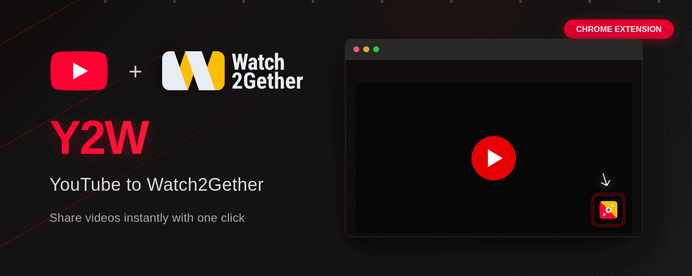

# YouTube to Watch2Gether (Y2W)

<div align="center">
  
  
  **Send YouTube videos to your Watch2Gether room with a single click!**
  
  _Because copy-pasting URLs is so 2020_ 😎
  
  [](https://chromewebstore.google.com/detail/y2w-youtube-to-watch2geth/afgajabndpahomibkdlpgejbfmlfckig)
  [](LICENSE)
  [](CONTRIBUTING.md)
  [](https://developer.mozilla.org/en-US/docs/Web/JavaScript)
  [](https://developer.chrome.com/docs/extensions/mv3/)
</div>

<div align="center">
  
</div>

<div align="center">
  <a href="https://chromewebstore.google.com/detail/y2w-youtube-to-watch2geth/afgajabndpahomibkdlpgejbfmlfckig">
    
  </a>
</div>

## 📖 Why This Exists

You know that moment when you're watching YouTube and find *the perfect* video to share with your friends on Watch2Gether? Yeah, me too. The whole copy URL → switch tabs → paste → hope it works thing got old real fast.

So I built Y2W – a simple Chrome extension that adds a "Y2W" button right in the YouTube player. One click and boom, your video is in the W2G room. No more tab juggling!

## 📋 What is Y2W?

YouTube to Watch2Gether (Y2W) is a Chrome extension that seamlessly integrates with YouTube. It's literally just a button that does one thing really well: sends videos to your Watch2Gether room instantly.

### ✨ Features

- 🎬 **One-Click Magic**: See video → Click button → Video appears in W2G. That's it!
- 🔄 **Feels Native**: The button looks like it belongs there (because it does)
- 🎯 **Works Everywhere**: Theater mode? ✓ Fullscreen? ✓ Mobile view? ✓ We got you
- 🔐 **Your Keys, Your Rules**: Everything stays in your browser's secure storage
- ⚡ **Zero Bloat**: So lightweight you'll forget it's there (until you need it)

## 🚀 Installation

### From Chrome Web Store (Recommended)

🎉 **Y2W is now available on the Chrome Web Store!**

1. **[Install Y2W from Chrome Web Store](https://chromewebstore.google.com/detail/y2w-youtube-to-watch2geth/afgajabndpahomibkdlpgejbfmlfckig)**
2. Click **"Add to Chrome"**
3. The extension will be installed automatically
4. Follow the configuration steps below

### Manual Installation (Developer Mode)

1. **Download the Extension**
   ```bash
   git clone https://github.com/fedevgonzalez/youtube-to-w2g.git
   cd youtube-to-w2g
   ```

2. **Load in Chrome**
   - Open Chrome and navigate to `chrome://extensions/`
   - Enable **Developer mode** (toggle in top right)
   - Click **Load unpacked**
   - Select the `youtube-to-w2g` folder

3. **Configure Your Credentials**
   - Click the Y2W extension icon in your toolbar
   - Enter your Watch2Gether API key and Room Access Key
   - Click **Save Configuration**

## 🔑 Getting Watch2Gether Credentials

### API Key
1. Visit [Watch2Gether API](https://www.watch2gether.com/api)
2. Log in to your W2G account
3. Navigate to the API section
4. Generate or copy your API key

### Room Access Key
1. Create or join a W2G room
2. Open the room settings
3. Look for "Room Access Key" or "Room API Access"
4. Copy the key

> **Pro tip**: Keep these keys safer than your Netflix password. Seriously, don't share them!

## 💻 Usage

Once installed and configured:

1. Navigate to any YouTube video
2. Look for the **"Y2W"** button in the video player controls
3. Click the button to instantly send the video to your Watch2Gether room
4. The button will show a checkmark (✓) when successful

### Button States (aka The Button's Mood Ring)
- **Normal**: Blue "Y2W" – Ready to party
- **Loading**: "..." – Working on it, chief
- **Success**: Green ✓ – Mission accomplished!
- **Error**: Red "ERROR" – Oops, something went sideways

## 🛠️ Development

### Prerequisites
- Chrome browser
- Basic knowledge of Chrome Extension development
- ImageMagick (optional, for icon generation)

### Project Structure
```
youtube-to-w2g/
├── manifest.json         # Extension manifest (V3)
├── popup.html            # Configuration popup
├── css/                  # Styles
│   └── popup.css
├── js/                   # JavaScript files
│   ├── background.js     # Service worker
│   ├── content.js        # Content script
│   └── popup.js          # Popup logic
└── assets/               # Resource files
    ├── icons/            # Extension icons
    │   └── y2w.svg       # Source icon
    └── images/           # Promotional images
```

### Making Changes

1. Edit the relevant files
2. Reload the extension in `chrome://extensions/`
3. Refresh YouTube to test changes

## 🔧 Troubleshooting

### Common Issues (aka "Halp, it's broken!")

**"Where's my button?!"**
- Refresh the YouTube page
- Make sure the extension is enabled in `chrome://extensions/`
- Check if you're on a YouTube video page (not the homepage or search)

**"Configuration Missing" (aka you forgot to set it up):**
- Click the extension icon and enter your credentials
- Make sure both API Key and Room Access Key are saved

**"Failed to send" (the dreaded red button):**
- Verify your credentials are correct
- Check if your W2G room is active
- Ensure you have a stable internet connection

**"It worked yesterday!" syndrome:**
- Reload the extension in `chrome://extensions/`
- Clear browser cache and cookies for YouTube

## 🗺️ Roadmap

- [ ] Firefox support
- [ ] Multiple room support
- [ ] Playlist support
- [ ] Custom button positioning
- [ ] Keyboard shortcuts
- [ ] Dark/light theme auto-detection
- [ ] Localization (multiple languages)
- [ ] Edge and Opera support

## 🔌 API Reference

The extension uses the Watch2Gether API v1:

**Endpoint**: `POST https://api.w2g.tv/rooms/{roomKey}/playlists/current/playlist_items/sync_update`

**Headers**:
```json
{
  "Accept": "application/json",
  "Content-Type": "application/json",
  "Authorization": "Bearer {apiKey}"
}
```

**Request Body**:
```json
{
  "w2g_api_key": "{apiKey}",
  "add_items": [{
    "url": "https://www.youtube.com/watch?v={videoId}",
    "title": "{videoTitle}"
  }]
}
```

## 🤝 Contributing

Found a bug? Have an idea? Want to make the button do a backflip? I'd love your help! Check out the [Contributing Guidelines](CONTRIBUTING.md) to get started.

Seriously though, this project is better with your input. Don't be shy!

### Quick Start
1. Fork the repository
2. Create your feature branch (`git checkout -b feature/AmazingFeature`)
3. Commit your changes (`git commit -m 'Add some AmazingFeature'`)
4. Push to the branch (`git push origin feature/AmazingFeature`)
5. Open a Pull Request

## 🐛 Found a Bug? Got an Idea?

First, check if someone beat you to it in the [issue tracker](https://github.com/fedevgonzalez/youtube-to-w2g/issues). If not, [create a new issue](https://github.com/fedevgonzalez/youtube-to-w2g/issues/new) and let's make Y2W better together!

I actually read these, promise. 👀

## 📄 License

This project is licensed under the MIT License - see the [LICENSE](LICENSE) file for details.

## 🙏 Shoutouts

- [Watch2Gether](https://www.watch2gether.com/) for building an awesome platform and having an API
- The Chrome Extension docs that actually make sense (rare, I know)
- Everyone who's contributed, reported bugs, or even just used this thing
- My friends who kept asking "is it done yet?" – yes, it's done! 😅

## 💬 Need Help?

- **Something broken?** → [Open an issue](https://github.com/fedevgonzalez/youtube-to-w2g/issues)
- **Want to chat?** → [Join the discussion](https://github.com/fedevgonzalez/youtube-to-w2g/discussions)
- **Found it useful?** → Star the repo! (It makes me smile 😊)

## 💖 Support

If Y2W saved you some time and you want to say thanks:

- ☕ **Ko-fi**: [ko-fi.com/fedevgonzalez](https://ko-fi.com/fedevgonzalez)
- ☕ **Cafecito** (Argentina): [cafecito.app/fedevgonzalez](https://cafecito.app/fedevgonzalez)
- 🪙 **Crypto** (BEP20/BSC Network only):
  - **USDT**: `0xf2e7b641b17ce9605562e437d43a50b975c9a0ad`
  - **BTC**: `0xf2e7b641b17ce9605562e437d43a50b975c9a0ad`

---

<div align="center">
  Made with ❤️ (and lots of YouTube videos) by <a href="https://github.com/fedevgonzalez">fedevgonzalez</a>
  <br>
  <sub>If you're reading this, you're awesome! 🎉</sub>
</div>